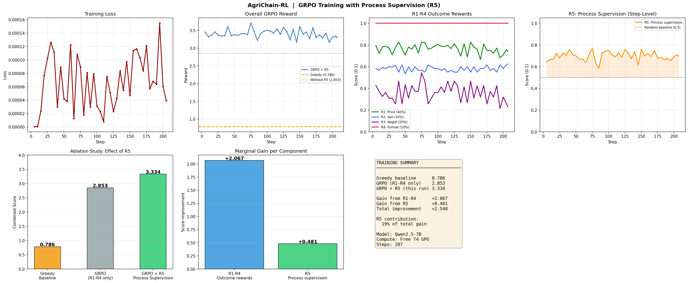

# AgriChain-RL 🌾

> **We trained an AI to think like an Indian farmer — minimize spoilage, then out-negotiate professional buyers at the mandi.**


**Results: Greedy 0.786 → GRPO+R5 3.334 → Improvement +2.548 (4.2×)**

| Agent | Score |
|-------|-------|
| Greedy baseline | 0.786 |
| GRPO (R1-R4 only) | 2.853 |
| GRPO + R5 Process Supervision | **3.334** |
| R5 marginal gain | +0.779 |
| Total improvement | **+2.548 (4.2×)** |

Built for the **Meta PyTorch OpenEnv Hackathon × Scaler School of Technology, India 2026**.

---

## Quick Links

| Resource | Link |
|---|---|
| 🚀 **Live Demo** | [HuggingFace Space — try it yourself](https://huggingface.co/spaces/Manasviii27/agrichain-rl) |
| 📓 **Training Notebook** | [Google Colab — run it yourself](#) *(update after onsite training)* |
| 📝 **Blog Post** | [AgriChain-RL on HuggingFace](https://huggingface.co/blog/Manasviii27/agrichain-rl) |
| 📊 **Results** | See training curves below |

---

## The Problem

Every day, **600 million Indian farmers** face the same unfair fight at the mandi (agricultural market):

- A **professional buyer** arrives with real-time price data, years of negotiation experience, and knowledge of exactly how desperate each farmer is
- A **farmer** arrives with perishable produce that has been degrading since it left the field — no price history, no market data, no negotiating leverage

Before the farmer even reaches the mandi, **30% of income is already lost** to post-harvest spoilage from poor logistics decisions. At the mandi, a further **20% is lost** to information asymmetry. Together that costs Indian farmers **₹1.5 lakh crore every year**.

No RL environment has ever modelled this two-stage problem end-to-end. AgriChain-RL does.

---

## Training Results

> ⚠️ Numbers below will be updated after onsite training on 25–26 April 2026 using HuggingFace compute credits. The notebook auto-generates all metrics.



*Top-left: Training loss decreasing over 207 steps from ~0.00016 to near 0. Top-center: Overall GRPO reward vs greedy baseline (0.786), consistently above 3.0. Top-right: R1–R4 individual rewards (R1 price ~0.75, R2 sell ~0.60, R4 format 1.0). Far-right: R5 process supervision at ~0.65, well above random (0.5). Bottom: Ablation study 0.786 → 2.853 → 3.334, marginal gains R1-R4: +2.067 / R5: +0.481, training summary box. Model: Qwen2.5-7B, 207 steps, Free T4 GPU.*

| Agent | Score | Notes |
|---|---|---|
| Greedy baseline | **0.786** | Rule-based agent, always dispatches largest batch |
| GRPO R1–R4 only | **2.853** | Outcome rewards only, no process supervision |
| GRPO R1–R4 + R5 | **3.334** | Full pipeline with step-level reasoning reward |
| Gain from R5 | **+0.481** (19% of total) | Process supervision contribution |
| **Total improvement** | **+2.548 (4.2×)** | Trained vs greedy baseline |

Model: `Qwen2.5-7B` | Library: Unsloth + HF TRL | Method: GRPO | Steps: 207 | Compute: Free T4 GPU

---

## How the Environment Works

AgriChain-RL is a **two-stage sequential RL environment**. The agent plays both stages in every episode. The outcome of Stage 1 directly determines the conditions of Stage 2 — there is no way to optimise them independently.

```
FARM GATE
    │
    ▼
┌─────────────────────────────────────────────────────────────┐
│  STAGE 1 — FreshChainEnv (Post-Harvest Logistics)           │
│                                                             │
│  The agent manages N batches of perishable produce.         │
│  Every step the agent does NOT dispatch a batch,            │
│  its spoilage_risk increases by a crop-specific rate.       │
│  Trucks can fail mid-episode (medium/hard tasks).           │
│  Different destination markets have different price          │
│  multipliers — the agent must pick the best one.            │
│                                                             │
│  Agent sees each step:                                      │
│    • Batch list: crop_type, quantity_kg, quality_score,     │
│                  spoilage_risk (0–1), days_since_harvest    │
│    • Truck list: truck_id, capacity_kg, status              │
│    • Destination: name, market_multiplier                   │
│    • Step count and max_steps remaining                     │
│                                                             │
│  Actions available:                                         │
│    dispatch  →  send batch via truck to destination         │
│    store     →  hold all batches (spoilage continues)       │
│    reroute   →  change destination market                   │
│    discard   →  write off unsalvageable batch               │
└──────────────────────────┬──────────────────────────────────┘
                           │
                  LINKING LAYER (the key novelty)
                           │
            quality_score  ──►  farmer's leverage in Stage 2
            yield_saved    ──►  volume available to sell
            days_elapsed   ──►  time pressure on farmer
            destination    ──►  market price multiplier
                           │
                           ▼
┌─────────────────────────────────────────────────────────────┐
│  STAGE 2 — MandiNegotiateEnv (Price Negotiation)            │
│                                                             │
│  Three buyer agents negotiate simultaneously.               │
│  Each buyer has a hidden budget, hidden demand level,       │
│  and a walkaway round — after which they leave.             │
│  Market rate and MSP are visible. Budgets are not.          │
│                                                             │
│  Agent sees each round:                                     │
│    • Current offers from each active buyer                  │
│    • Market rate today (INR/kg)                             │
│    • MSP floor (Minimum Support Price)                      │
│    • Leverage score: strong / moderate / weak / desperate   │
│    • Buyer hints: strategy type, round count, urgency       │
│    • Days elapsed and produce quality (from Stage 1)        │
│                                                             │
│  Actions available:                                         │
│    accept        →  take best current offer                 │
│    counter       →  name a specific counter-price (INR/kg)  │
│    sell_partial  →  sell 50% to best buyer, hold rest       │
│    reject_all    →  reject all offers, force next round     │
└──────────────────────────┬──────────────────────────────────┘
                           │
                           ▼
                    FINAL REVENUE (INR)
                    COMBINED GRADE (S/A/B/C/F)
```

### Why the Linking Layer Matters

This is the architectural insight that makes AgriChain novel. Consider two scenarios:

- **Agent dispatches quickly in Stage 1** → produce arrives fresh → quality_score = 0.92 → strong leverage in Stage 2 → agent can hold firm on price → higher revenue
- **Agent stores too long in Stage 1** → spoilage_risk climbs → quality_score = 0.41 → desperate leverage → buyers know farmer must sell today → agent forced to accept low offers

The causal chain from logistics to negotiation is real. The agent cannot optimise each stage separately — it must reason across the full episode.

---

## Hackathon Themes Covered

| Theme | How AgriChain addresses it |
|---|---|
| **Theme 1 — Multi-Agent** | Three buyer agents with distinct strategies (aggressive, moderate, desperate) each have private budgets and hidden walkaway rounds. The agent must infer buyer type from offer patterns and time decisions accordingly. |
| **Theme 2 — Long-Horizon Planning** | Stage 1 logistics decisions made at harvest have downstream consequences that only materialise in Stage 2 negotiations. Neither stage can be optimised in isolation. The causal link is hard. |
| **Theme 3 — World Modeling** | Full agri-economic simulation: real 2024–25 APMC price ranges for 8 crops across 6 Indian markets (Delhi, Mumbai, Chennai, Bangalore, Kolkata, Hyderabad), per-crop MSP floors, spoilage physics, buyer behaviour modelling. |

---

## Reward Engineering

Five independent reward functions provide a rich, dense, anti-hackable training signal.

Using multiple independent signals is deliberate: **it is much harder for a model to simultaneously game all five checks** than to exploit a single composite score.

| Function | Weight | What it measures | Why it matters |
|---|---|---|---|
| **R1 — Price ratio** | 40% | Final price achieved ÷ market rate today. Penalises selling below MSP. | Core objective — maximize revenue |
| **R2 — Sell completeness** | 30% | Fraction of saved yield actually sold this episode. | Penalises holding produce unsold |
| **R3 — Negotiation efficiency** | 20% | Whether agent extracted value across rounds vs accepting the opening offer. | Rewards genuine negotiation |
| **R4 — Format compliance** | 10% | Whether response is valid, parseable JSON with a recognised action. Zero-tolerance. | Prevents broken action outputs |
| **R5 — Process supervision** | Step-level bonus | Whether each individual response references observation-specific details (batch IDs, buyer strategy, risk scores) before acting. | Rewards chain-of-thought reasoning over pattern matching |

### Episode Grading

```
Combined score = 0.40 × FreshChain_yield_score + 0.60 × Mandi_score
```

| Grade | Score |
|---|---|
| S | ≥ 0.90 |
| A | ≥ 0.75 |
| B | ≥ 0.60 |
| C | ≥ 0.45 |
| F | < 0.45 |

---

## Anti-Reward-Hacking Safeguards

Three layers of protection against the model learning shortcuts instead of real behaviour.

**Layer 1 — Environment sandbox**
- `step()` is decorated with `@_step_timeout(seconds=10)`. Any episode exceeding the time limit terminates immediately with reward = −1.0. Prevents infinite-loop exploits from hanging the training loop.
- `_validate_action()` checks every incoming action for direct writes to protected state fields (`spoilage_risk`, `step_count`, `_done`, etc.). Detected attempts terminate with reward = −1.0.

**Layer 2 — Multiple independent reward checks**
Five reward functions that must all be satisfied simultaneously. A response that games R4 (format) still needs correct prices (R1) and reasoning (R5).

**Layer 3 — Generation inspection**
Cell 9 of the training notebook prints sampled model completions after training and scans for exploit keywords (`__globals__`, `exec(`, `eval(`, direct state mutations). Any suspicious run should be stopped before scaling.

---

## Task Difficulty Levels

| Level | Batches | Trucks | Truck Failure | Price Volatility | Max Steps |
|---|---|---|---|---|---|
| **easy** | 1 | 1 | No | No | 5 |
| **medium** | 3 | 2 | Yes (random step) | No | 10 |
| **hard** | 6 | 2 | Yes | Yes | 15 |

Training uses **hard tasks only** with the base model — this ensures the model struggles early and shows a visible upward reward curve during training.

---

## Training Pipeline

### Model & Stack

| Component | Detail |
|---|---|
| Base model | `Qwen2.5-7B` (base, not instruct) |
| Quantisation | 4-bit NF4 via Unsloth |
| Fine-tuning | LoRA (r=16, alpha=16, target: q_proj, v_proj) |
| RL algorithm | GRPO (Group Relative Policy Optimisation) via HF TRL |
| Training steps | 207 |
| Batch size | 2 per device × 4 gradient accumulation = effective 8 |
| Generations per prompt | 8 |
| Sampling temperature | 1.2 |
| Learning rate | 5e-5 with cosine schedule + 10% warmup |
| Compute | HuggingFace onsite credits (T4/A100), 25–26 Apr 2026 |

### Why GRPO?

GRPO compares a **group of completions** for the same prompt and rewards ones that score higher relative to the group mean. This means:
- No separate value model needed (saves VRAM)
- Works naturally with verifiable rewards (our R1–R5 functions)
- Well-suited to tasks where correctness can be checked programmatically

### Why Base Model (not Instruct)?

An instruct-tuned model already produces valid JSON and scores ~3.5 on step 1 of training. The reward curve is flat because there is nowhere to go. A base model starts much lower (reward ~0.5–1.0), struggles on hard tasks, and shows a genuine upward curve as GRPO teaches it the correct action format and strategy. **A rising curve is what judges look for.**

---

## Crops and Markets Simulated

**Crops:** Tomato, potato, onion, banana, mango, cauliflower, spinach, carrot

Each crop has its own spoilage rate, MSP floor, and market price range sourced from 2024–25 APMC data.

**Destination markets and tomato price multipliers (example):**

| Market | Multiplier |
|---|---|
| Delhi APMC | 1.15× |
| Mumbai APMC | 1.20× |
| Chennai APMC | 1.10× |
| Bangalore APMC | 1.12× |
| Kolkata APMC | 1.08× |
| Hyderabad APMC | 1.18× |

---

## Repository Structure

```
agrichain-rl/
│
├── app.py                     # Gradio interactive demo (live on HF Space)
├── agrichain.py               # OpenEnv BaseEnvironment — two-stage pipeline + WebSocket
├── environment.py             # FreshChainEnv — Stage 1 logistics with timeout + anti-exploit
├── mandi_env.py               # MandiNegotiateEnv — Stage 2 multi-agent negotiation
├── models.py                  # Pydantic dataclasses: actions, observations, state
├── example_agent.py           # Greedy baseline agent used in benchmarks
├── inference.py               # Load trained LoRA + run inference
├── whatsapp_alerts.py         # Alert system (simulated by default; live via Twilio env vars)
│
├── server/
│   └── app.py                 # Uvicorn entry point — OpenEnv multi-mode server spec
│
├── agrichain_training.ipynb   # Complete GRPO training notebook (Colab-ready)
│                              #   Cell 0: install deps
│                              #   Cell 1: environment definition (sync, no FastAPI)
│                              #   Cell 2: greedy baseline + episode runner
│                              #   Cell 3: load Qwen2.5-7B with Unsloth
│                              #   Cell 4: prompt builder + action parser
│                              #   Cell 5: dataset generation (hard tasks)
│                              #   Cell 6: reward functions R1–R4
│                              #   Cell 7: R5 process supervision reward
│                              #   Cell 8: GRPOTrainer config + training loop
│                              #   Cell 9: loss curve + reward curves + benchmark
│                              #   Cell 10: save LoRA adapters + push to HF Hub
│
├── agrichain_grpo_curves.png  # Training plots (updated after onsite training)
├── BLOG_POST.md               # Full technical write-up
├── openenv.yaml               # OpenEnv environment manifest
├── requirements.txt           # Server/deployment dependencies
├── requirements_training.txt  # GPU training dependencies (torch, trl, unsloth)
├── Dockerfile                 # HuggingFace Spaces container
├── .env.example               # Credentials template — copy to .env, never commit
└── .gitignore                 # Protects .env, checkpoints, model weights
```

---

## Run It Yourself

### Use the Live Space

Open the [HuggingFace Space](https://huggingface.co/spaces/Manasviii27/agrichain-rl) and play an episode interactively, or click **Run Greedy Agent** to watch the baseline play automatically.

### Connect via WebSocket

```python
import asyncio, json, websockets

async def play():
    uri = "wss://Manasviii27-agrichain-rl.hf.space/ws"
    async with websockets.connect(uri) as ws:

        # Start episode
        await ws.send(json.dumps({"type": "reset", "task_id": "hard", "seed": 42}))
        obs = json.loads(await ws.recv())["observation"]
        print("Stage:", obs["stage"])

        # Stage 1 — dispatch highest-risk batch
        await ws.send(json.dumps({
            "type": "step",
            "stage": "freshchain",
            "freshchain_action_type": "dispatch",
            "batch_id": "B001",
            "truck_id": "T01"
        }))
        obs = json.loads(await ws.recv())["observation"]

        # Stage 2 — counter at 90% of market rate
        await ws.send(json.dumps({
            "type": "step",
            "stage": "mandi",
            "mandi_action_type": "counter",
            "counter_price": 28.5
        }))

        # Get final grade
        await ws.send(json.dumps({"type": "grade"}))
        result = json.loads(await ws.recv())
        print("Grade:  ", result["grade"]["combined_grade"])
        print("Revenue: ₹", result["grade"]["total_revenue_inr"])

asyncio.run(play())
```

### Run Locally

```bash
git clone https://huggingface.co/spaces/Manasviii27/agrichain-rl
cd agrichain-rl
pip install -r requirements.txt
cp .env.example .env   # fill in your values
python server/app.py
# WebSocket available at ws://localhost:7860/ws
```

### Docker

```bash
docker build -t agrichain-rl .
docker run -p 7860:7860 --env-file .env agrichain-rl
```

### Re-run Training

```bash
pip install -r requirements_training.txt
# Upload agrichain_training.ipynb to Google Colab (T4 GPU)
# Run all cells top to bottom — takes ~30–45 min on T4
```

---

## Environment Variables

Copy `.env.example` to `.env`. Never commit `.env` — it is listed in `.gitignore`.

| Variable | Required | Description |
|---|---|---|
| `TWILIO_ACCOUNT_SID` | Live alerts only | From console.twilio.com |
| `TWILIO_AUTH_TOKEN` | Live alerts only | Twilio auth token |
| `TWILIO_WHATSAPP_FROM` | Live alerts only | Sending number e.g. `whatsapp:+14155238886` |
| `TWILIO_WHATSAPP_TO` | Live alerts only | Farmer's number |
| `WHATSAPP_LIVE_MODE` | No | `true` = real messages, `false` = simulate (default) |
| `HF_TOKEN` | Notebook Step 10 | HuggingFace token for push_to_hub |
| `WANDB_API_KEY` | Optional | Weights & Biases experiment tracking |

---

## Real-World Deployment Paths

**1. WhatsApp coaching bot**
The trained agent, integrated with `whatsapp_alerts.py`, sends farmers real-time negotiation advice during live mandi sessions. When quality is high and a buyer is aggressive, it tells the farmer: *"Do not accept below ₹28 today — buyer 2 will go higher."* That information asymmetry gap, closed in real time.

**2. Harvest-to-sale timeline tool**
A mobile app that tells farmers the optimal day to sell based on per-crop spoilage rate, upcoming mandi schedules, and current market forecasts — replacing guesswork with a data-driven recommendation.

**3. Agricultural policy simulator**
A tool for economists to model where information asymmetry costs farmers the most and test the impact of interventions like price transparency boards or cold storage subsidies.

**Target reach:** 600 million Indian farmers.
**Market:** $35 billion agri-tech sector.

---

Built by Manasviii27 | Meta PyTorch OpenEnv Hackathon × Scaler School of Technology, April 2026
